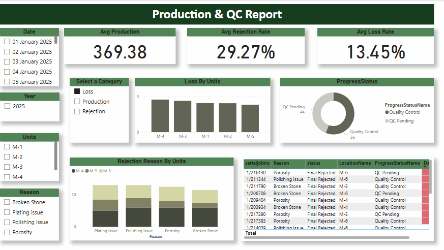
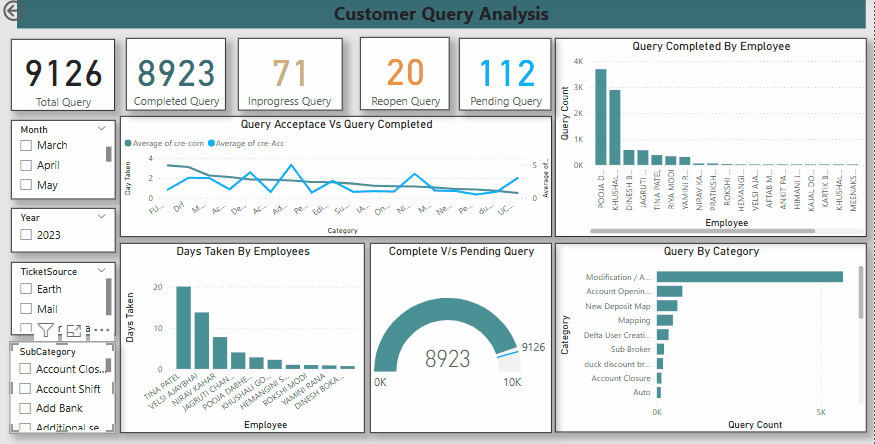
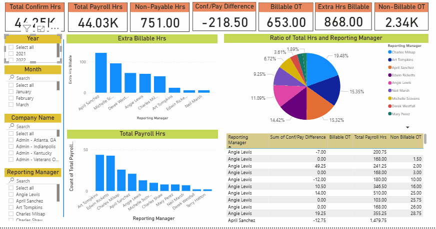

# Custom Jewelry Production & Sales Dashboard

This interactive dashboard offers a comprehensive view of both production and sales operations in a custom jewelry business. It enables teams to monitor process efficiency, manage delays, and make informed business decisions through insightful visuals and metrics.

1️⃣ Production Performance Monitoring -
The dashboard tracks key production metrics such as average production, rejection rate, and loss rate over time. A single slicer allows users to toggle between Production, Rejection, and Loss views. When the user selects one of these options, the bar chart dynamically updates to reflect the corresponding data theme. This interactive setup enables focused analysis of specific areas within the production process, helping to identify inefficiencies and performance gaps.

2️⃣ Workflow & Progress Tracking -
A visual tracker displays the number of jewelry items in each stage — Working, Pending, and Complete — offering a clear snapshot of current production status. A detailed table supports this view by showing jewelry ID, team, status, and time spent in each stage. Conditional formatting highlights delays (e.g., over 50 days), allowing quick identification of items needing attention.

3️⃣ Quality & Rejection Insights -
To support quality control, a rejection matrix visualizes patterns across different stages, helping pinpoint where most quality issues occur. This enables teams to take corrective action early, reduce waste, and improve overall product quality.

4️⃣ Customer & Sales Analysis -
Users can explore top-performing customers using a dynamic slicer that filters the top 2 to 10 clients. A detailed table updates accordingly, providing insight into key customer behavior and sales contribution. This feature supports targeted sales strategies and customer relationship management.

5️⃣ Revenue Breakdown & Trend Analysis -
The dashboard breaks down total sales into diamond value, gold value, and labor charges, offering a clear understanding of revenue composition. Additional visuals highlight sales by region and salesperson, while a drillable line chart displays sales trends over time. Key figures like total sales and total quantity sold are always visible and update with filter selections.

Preview:

# Customer Query Tracking Dashboard

This dashboard helps teams manage and analyze customer service queries with ease. It provides insights into how queries flow through departments, platforms, and resolution timelines.

Key Features:

1️⃣ View customer queries by source (email, phone, social media) to understand where most issues are reported.

2️⃣ Automatically map each query to its related department and topic for better resource allocation.

3️⃣ Track query status and resolution time with visual indicators for delays or bottlenecks.

4️⃣ Filter queries by custom time ranges to identify patterns and spikes in activity.

5️⃣ Monitor individual/team performance using average resolution time and assignment data.

Preview:

# Employee Management & Payroll Analysis Dashboard

This dashboard equips management with critical insights into workforce costs and payroll dynamics, enabling smarter financial control and strategic planning. By visualizing total payroll expenses alongside overtime pay, it empowers organizations to make informed decisions based on real-time data.

What This Dashboard Brings to Management:

1️⃣ A clear overview of total payroll and overtime trends, supporting effective cost management and budget forecasting.

2️⃣ Visibility into overtime distribution across teams or departments, helping management identify patterns of overuse or inefficiency.

3️⃣ Data-driven insights to optimize workforce allocation, ensuring resources are used efficiently without unnecessary overtime expenses.

4️⃣ Performance monitoring linked to payroll metrics, allowing leadership to align labor costs with productivity outcomes.

5️⃣ Actionable information for enhancing operational efficiency and supporting transparent, informed decision-making regarding human resources.

Preview:

# Booking Insights Dashboard

This dashboard provides a comprehensive view of booking patterns, revenue streams, and product performance, enabling businesses to make informed decisions on operations and sales strategies. It offers an interactive platform for analyzing booking data across venues, products, and categories while tracking revenue trends and customer behavior.

What This Dashboard Delivers:

1️⃣ A dynamic date range filter to analyze booking trends over specific time periods, enhancing temporal analysis of sales performance.

2️⃣ Venue-wise insights showing income, average booking value, and transaction volumes, helping management evaluate location-specific performance.

3️⃣ Comparative analysis of income generated from pre-bookings versus walk-in bookings, supporting better forecasting and promotional planning.

4️⃣ Revenue breakdown by product and category, offering clarity on high-performing items and areas for growth.

5️⃣ Interactive line charts displaying average income per booking over time, giving a visual trend of revenue flow across different venues.

6️⃣ A comprehensive transaction overview table summarizing booking details, transaction counts, and revenue, providing a clear operational snapshot.

Preview:

