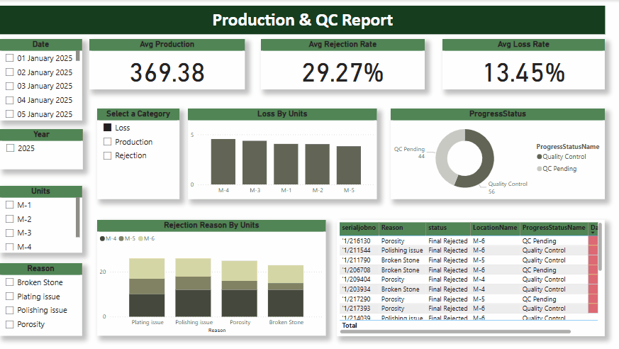

Project: Custom Jewelry Production & Sales Dashboard
This interactive dashboard offers a comprehensive view of both production and sales operations in a custom jewelry business. It enables teams to monitor process efficiency, manage delays, and make informed business decisions through insightful visuals and metrics.

1️⃣ Production Performance Monitoring -
The dashboard tracks key production metrics such as average production, rejection rate, and loss rate over time. A single slicer allows users to toggle between Production, Rejection, and Loss views. When the user selects one of these options, the bar chart dynamically updates to reflect the corresponding data theme. This interactive setup enables focused analysis of specific areas within the production process, helping to identify inefficiencies and performance gaps.

2️⃣ Workflow & Progress Tracking -
A visual tracker displays the number of jewelry items in each stage — Working, Pending, and Complete — offering a clear snapshot of current production status. A detailed table supports this view by showing jewelry ID, team, status, and time spent in each stage. Conditional formatting highlights delays (e.g., over 50 days), allowing quick identification of items needing attention.

3️⃣ Quality & Rejection Insights -
To support quality control, a rejection matrix visualizes patterns across different stages, helping pinpoint where most quality issues occur. This enables teams to take corrective action early, reduce waste, and improve overall product quality.

4️⃣ Customer & Sales Analysis -
Users can explore top-performing customers using a dynamic slicer that filters the top 2 to 10 clients. A detailed table updates accordingly, providing insight into key customer behavior and sales contribution. This feature supports targeted sales strategies and customer relationship management.

5️⃣ Revenue Breakdown & Trend Analysis -
The dashboard breaks down total sales into diamond value, gold value, and labor charges, offering a clear understanding of revenue composition. Additional visuals highlight sales by region and salesperson, while a drillable line chart displays sales trends over time. Key figures like total sales and total quantity sold are always visible and update with filter selections.

Preview:
